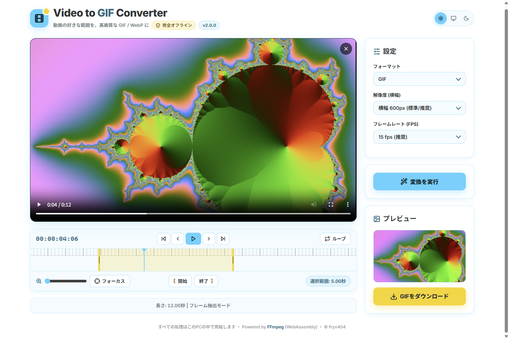
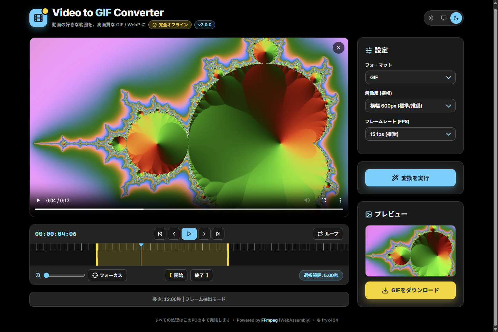
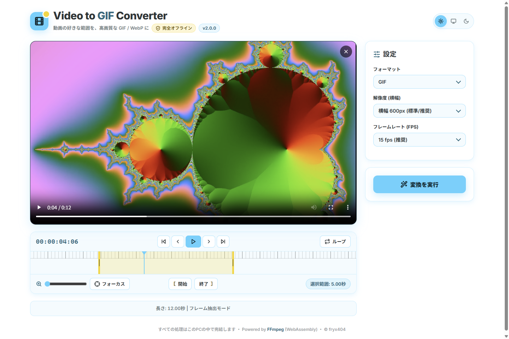

# Video to GIF Converter

動画（MP4 / MOV / WebM など）の好きな範囲を、高画質な **GIF** または **アニメーションWebP** に変換する Windows 用デスクトップアプリです。

変換はすべてPCの中（WebAssembly 版 FFmpeg）で行われ、動画がサーバーに送られることは一切ありません。社外秘の映像や制作途中の素材も安心して変換できます。インターネット接続も不要です。



| ダークテーマ | 範囲指定 |
|---|---|
|  |  |

## ダウンロード

**[BOOTH で無料配布中](https://fryx404.booth.pm/items/8111497)**（最新版: v2.0.0）

インストーラー・使い方PDF・使い方動画をまとめた zip をダウンロードできます。
開発継続を応援していただける方向けに「**500円のご支援枠**」もご用意しています（中身は無料版と同一です）。

- 動作環境: Windows 10 / 11（64bit）、メモリ 8GB 以上推奨
- FFmpeg や Node.js のインストールは不要です

> [!NOTE]
> コード署名をしていないため、初回インストール時に「Windows によって PC が保護されました」（SmartScreen）と表示されることがあります。［詳細情報］→［実行］でインストールできます。

## 主な機能

- **完全ローカル処理** — 動画のアップロードなし。FFmpeg（ffmpeg.wasm）をアプリに内蔵
- **Premiere ライクなタイムライン**
  - 再生・停止、コマ送り、開始位置 / 終了位置へのジャンプ
  - イン点 / アウト点の設定と、範囲の端のドラッグによる微調整
  - ズーム（最大50倍）、再生位置のフォーカス、選択範囲のループ再生
- **柔軟な出力設定**
  - フォーマット: GIF（palettegen / paletteuse の2パスで高画質化）/ アニメーションWebP
  - 解像度（横幅）: 480 / 600（推奨）/ 720 / 1280 / 1920px / オリジナル
  - フレームレート: 5 / 10 / 15（推奨）/ 24 / 30fps / オリジナル
- **プレビュー＆保存** — 仕上がりを確認して「元の動画名.gif / .webp」で保存
- **テーマ切替** — ライト / ダーク / システム連動（設定は次回起動時も保持）
- **大きなファイルにも対応** — 最大 2GB。動画をメモリにコピーせず必要な範囲だけを読み込む

## 使い方

1. **動画を読み込む** — ウィンドウに動画をドラッグ＆ドロップ（ドロップエリアのクリックでファイル選択も可）
2. **範囲を決める** — タイムラインで再生位置を合わせ、［[ 開始］［終了 ]］で変換する範囲を指定（範囲の端をドラッグして微調整、［ループ］で確認）
3. **設定を選ぶ** — 右側の「設定」でフォーマット・解像度・FPS を選択。迷ったら初期設定（GIF / 600px / 15fps）のままでOK
4. **変換する** — ［変換を実行］をクリック。進捗バーで進み具合を表示
5. **保存する** — プレビューを確認して［ダウンロード］

> [!TIP]
> フルHD などの高解像度で GIF を作るとファイルが非常に大きくなり、メモリ不足で失敗することがあります。高画質にしたいときは **WebP** がおすすめです。

### キーボードショートカット

| キー | 動作 |
|---|---|
| `Space` | 再生 / 停止 |
| `←` / `→` | 1コマ戻る / 進む |
| `I` / `O` | イン点 / アウト点を設定 |
| `Home` / `End` | イン点 / アウト点へ移動 |
| `L` | ループ再生の切り替え |
| `F` | 再生位置をタイムライン中央に表示 |

### 対応していない動画

HEVC（H.265）や ProRes など、アプリ内でプレビューできない形式は読み込めません（案内メッセージが表示されます）。H.264 の MP4 に書き出してから読み込んでください。

## 更新履歴

### v2.0.0（2026-09-27）

**デザイン**
- UI を独自デザインシステム「fryx404 Pop」（Electric Cyan × Sunshine Yellow）に全面刷新
- ライト / ダーク / システム連動のテーマ切替を追加（localStorage に保存）
- 絵文字アイコンを線画アイコンに置き換え、Inter フォントを同梱

**不具合の修正**
- ドロップエリアの外に動画を落とすと、画面が動画に置き換わって戻れなくなる問題を修正（ウィンドウ全体でドロップを受け付け）
- HEVC / ProRes など再生できない動画で「メタデータを解析中...」のまま止まる問題を修正
- 変換エラー（メモリ不足など）の後に再起動しないと変換できない問題を修正（FFmpeg を自動で再読み込み）
- 二重起動や、ポート 11020 が使用中のときに起動できない問題を修正（空きポートへ自動切替）
- 変換を繰り返すとメモリを使い続ける問題を修正（Blob URL を解放）
- ボタンの説明にあったショートカット（I / O）が動作しなかった問題を修正

**改善**
- キーボードショートカットを追加
- 保存ファイル名を `output.gif` から「元の動画名.gif」に変更
- Google Fonts の外部読み込みを廃止し、完全オフライン化
- Electron のセキュリティ設定を強化（`nodeIntegration` 無効、`contextIsolation` / `sandbox` 有効、外部ページへの遷移をブロック）

### v1.0.0（2026-03-21）

- 初回リリース

---

## 開発者向け

### 技術スタック

| レイヤー | 採用技術 |
|---|---|
| アプリ | Electron 41（electron-builder で NSIS インストーラー化） |
| ローカル配信 | Express 5（`127.0.0.1:11020` で `dist/` を配信し、COOP/COEP ヘッダーを付与） |
| 画面 | HTML / Vanilla JavaScript / Vanilla CSS（フレームワークなし）、Vite 5 |
| 動画処理 | `@ffmpeg/ffmpeg` 0.12 / `@ffmpeg/core` 0.12（WebAssembly） |
| デザイン | fryx404 Pop — CSS変数 + `light-dark()` によるトークン管理 |

### ファイル構成

```
├─ index.html               画面（ヘッダー / 読み込み・タイムライン / 設定・変換・プレビュー）
├─ src/
│  ├─ main.js               初期化・読み込み・変換フロー・状態管理
│  ├─ core/ffmpeg.js        FFmpeg の初期化・再起動、WORKERFS マウント、GIF / WebP 変換
│  ├─ ui/dom.js             DOM 参照とエラー表示
│  ├─ ui/events.js          ドラッグ＆ドロップ・ファイル選択・キーボードショートカット
│  ├─ ui/timeline.js        タイムライン（ドラッグ・イン/アウト・ズーム・ループ）
│  ├─ style.css             デザイントークン（色・影・角丸）と全コンポーネントのスタイル
│  └─ assets/fonts/         Inter（可変フォント）
├─ public/
│  ├─ theme.js              テーマ Provider（<head> で同期読み込み）
│  └─ ffmpeg/               ffmpeg-core.js / ffmpeg-core.wasm
├─ electron/main.js         Electron メインプロセス（ローカルサーバー・ウィンドウ）
└─ build/icon.png           アプリアイコン
```

### セットアップと実行

[Node.js](https://nodejs.org/) が必要です。

```bash
npm install
npm run dev            # ブラウザで開発（http://localhost:5173）
npm run dev:electron   # Electron で開発
```

`ffmpeg.wasm` は `SharedArrayBuffer` を利用するため、`vite.config.js` で COOP / COEP ヘッダーを付与しています。

### ビルド

```bash
npm run build            # Web 版（dist/）
npm run build:electron   # Windows インストーラー（dist_electron/Video to GIF Converter Setup <version>.exe）
```

インストーラーには実行環境（ブラウザエンジン・ローカルサーバー・FFmpeg）がすべて含まれるため、`.exe` 1つを渡すだけで動作します。

### Web 版のデプロイ

Vercel / Cloudflare Pages / Netlify などに置く場合は、サーバー側で COOP / COEP ヘッダーを返すよう設定してください。Vercel 用の設定は `vercel.json` にあります。

## ライセンス

本アプリは動画処理にオープンソースの **FFmpeg**（[ffmpeg.wasm](https://github.com/ffmpegwasm/ffmpeg.wasm)）を使用しています。FFmpeg のライセンス（LGPL / GPL）を尊重し、ソースコード全体を公開しています。

- アプリ本体のご利用に特別な制限はありません。
- ソースコードを利用（フォーク・改変）する場合は、FFmpeg のライセンスに準じた扱いが必要な点にご留意ください。詳細は各モジュールのライセンスをご確認ください。
- 同梱フォント Inter は SIL Open Font License 1.1 で提供されています。

## お問い合わせ

不具合報告・ご感想は [X（@fryx404）](https://x.com/fryx404) または GitHub の Issues までお寄せください。
